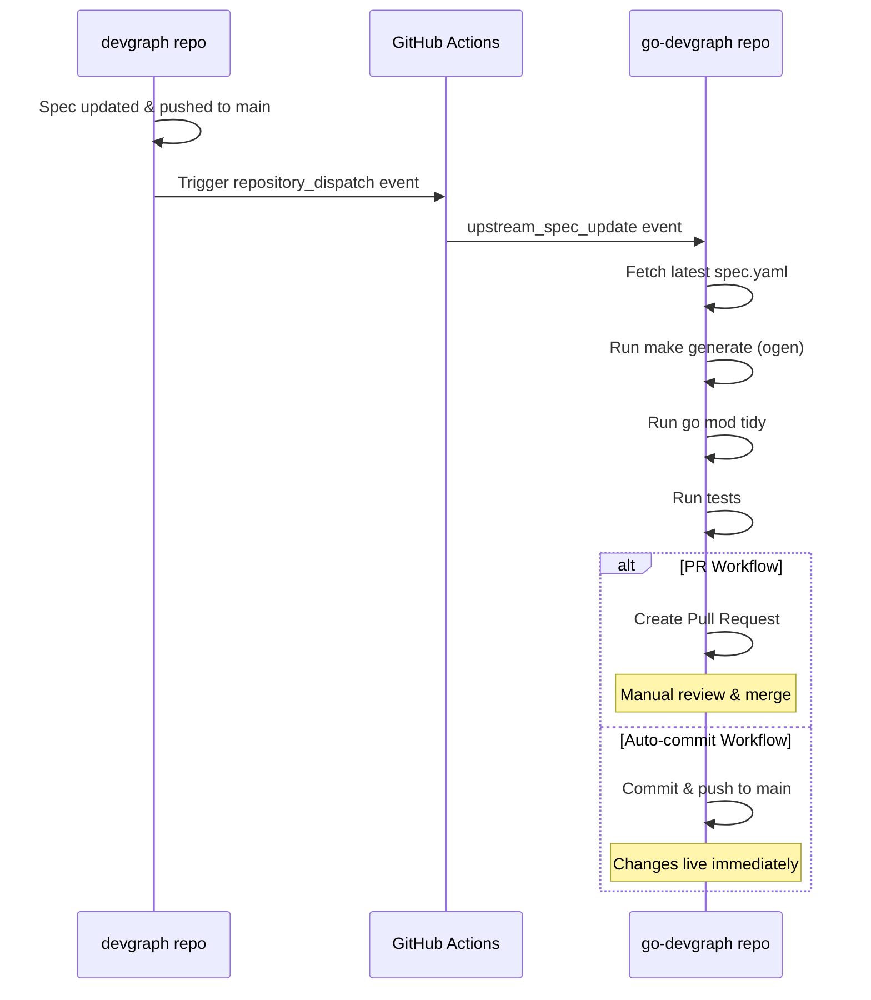

# go-devgraph Workflows

This repository contains GitHub Actions workflows for automatically regenerating the Go client when the upstream Devgraph API specification changes.

## Workflows

### 1. `upstream-sync.yml` - Create Pull Request (Recommended)
**Trigger**: Dispatched from `arctir/devgraph` on spec updates

Creates a pull request with regenerated client code when the upstream API spec changes.

**Pros:**
- ✅ Safe - allows review before merging
- ✅ CI runs on the PR to validate changes
- ✅ Can catch breaking changes before they affect consumers

**Cons:**
- ❌ Requires manual PR approval and merge

### 2. `upstream-sync-auto-commit.yml` - Auto-commit to Main
**Trigger**: Dispatched from `arctir/devgraph` on spec updates

Automatically regenerates and commits client code directly to the `main` branch.

**Pros:**
- ✅ Fully automated - no manual intervention needed
- ✅ Changes available immediately

**Cons:**
- ❌ No review step - changes go live automatically
- ❌ Could break downstream consumers if spec has issues
- ❌ Requires tests to pass before committing

## Which Workflow Should I Use?

**Use `upstream-sync.yml` (PR) if:**
- You want human review of generated code changes
- You have breaking changes or complex APIs
- You want to validate changes before they go live
- You're in a team environment with code review requirements

**Use `upstream-sync-auto-commit.yml` (Auto-commit) if:**
- You have comprehensive test coverage
- Your API changes are mostly additive (non-breaking)
- You want zero-touch automation
- You trust the upstream spec quality

**Current recommendation**: Use the PR approach (`upstream-sync.yml`) initially, then switch to auto-commit once you're confident in the process.

## Setup

### Option 1: Enable PR Workflow (Recommended)

1. Rename `upstream-sync.yml` to enable it (or delete the auto-commit one):
   ```bash
   # This file is already enabled by default
   ```

2. Ensure the repository has the default `GITHUB_TOKEN` permissions:
   - Go to Settings → Actions → General
   - Under "Workflow permissions", select "Read and write permissions"
   - Check "Allow GitHub Actions to create and approve pull requests"

### Option 2: Enable Auto-commit Workflow

1. Delete or disable `upstream-sync.yml` and enable `upstream-sync-auto-commit.yml`

2. Ensure the repository has write permissions:
   - Go to Settings → Actions → General
   - Under "Workflow permissions", select "Read and write permissions"

## How It Works



## Manual Trigger

You can manually trigger the workflow from the Actions tab:

1. Go to Actions → Select the workflow
2. Click "Run workflow"
3. Select the branch
4. Click "Run workflow"

## Troubleshooting

### Workflow not triggering

1. **Check the dispatch event**: The upstream repo must send `upstream_spec_update` event type
2. **Verify token permissions**: Ensure `DOWNSTREAM_DISPATCH_TOKEN` is set in the devgraph repo
3. **Check workflow is enabled**: Workflows must be in the default branch to receive dispatch events

### Tests failing

If tests fail:
- **PR workflow**: PR is still created so you can investigate
- **Auto-commit workflow**: Commit is blocked, check Actions logs

### Generated code not building

This usually means:
1. The OpenAPI spec has validation errors
2. The ogen generator version needs updating
3. Go dependencies are out of date

Fix by updating locally:
```bash
make generate
go mod tidy
go test ./...
```

## Local Development

To regenerate the client locally:

```bash
# Make sure you have the latest spec from devgraph repo
cd ../devgraph
git pull origin main

# Return to go-devgraph and regenerate
cd ../go-devgraph
make generate
go mod tidy
go test ./...
```

## Configuration

### Makefile
The `Makefile` defines how the client is generated:
- Spec location: `../devgraph/specs/devgraph/v1/spec.yaml`
- Output: `pkg/apis/devgraph/v1`
- Generator: `ogen`

### ogen.yaml
Configuration for the ogen code generator. See [ogen documentation](https://ogen.dev/) for options.

## Questions?

See the main devgraph repository's [GitHub Actions documentation](https://github.com/arctir/devgraph/blob/main/.github/workflows/README.md) for more details on the overall automation strategy.
